# Demo

<figure>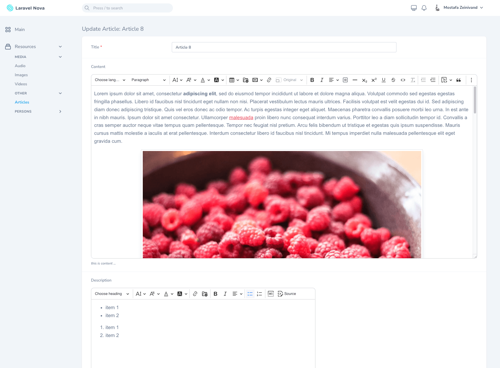<figcaption>
CkEditor
</figcaption></figure>

 

<figure>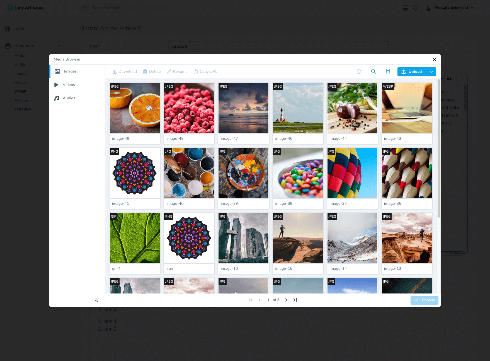<figcaption>
Image Browser
</figcaption></figure>

 

<figure>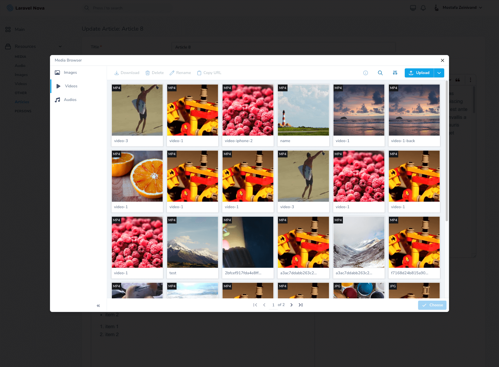<figcaption>
Video Browser
</figcaption></figure>

 

<figure>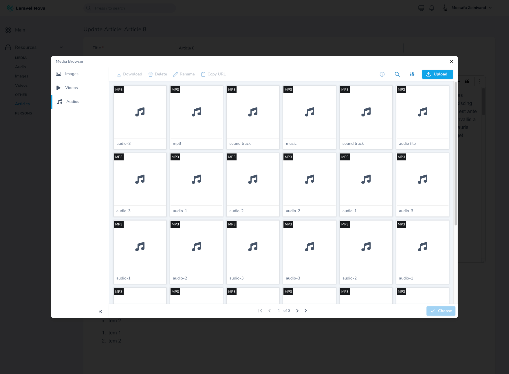<figcaption>
Audio Browser
</figcaption></figure>

 

<figure>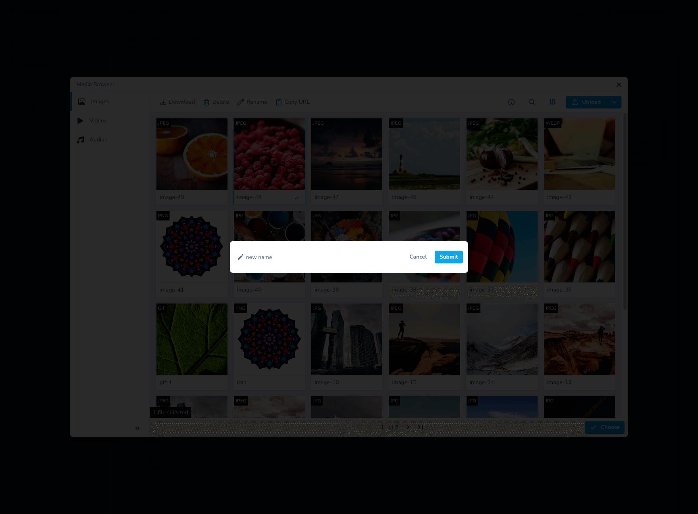<figcaption>
Rename Media
</figcaption></figure>

 

<figure>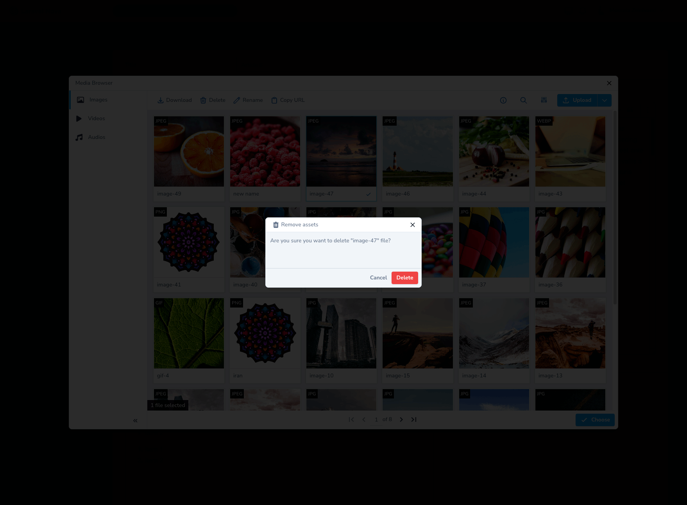<figcaption>
Delete Media
</figcaption></figure>

<figure>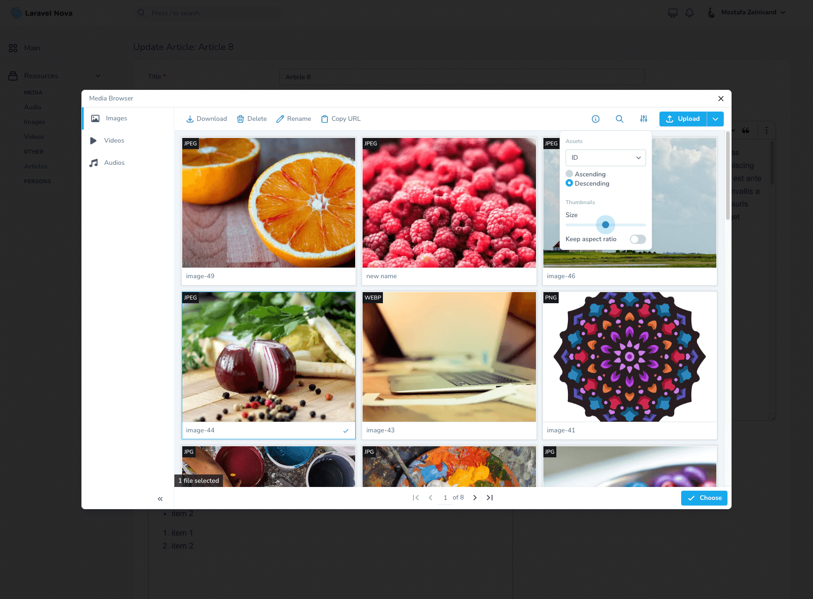<figcaption>
Resize Thumbnails
</figcaption></figure>

 

<figure>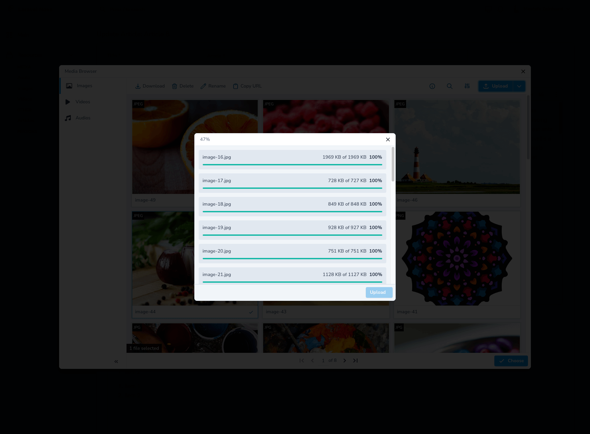<figcaption>
Upload Media
</figcaption></figure>

 

<figure>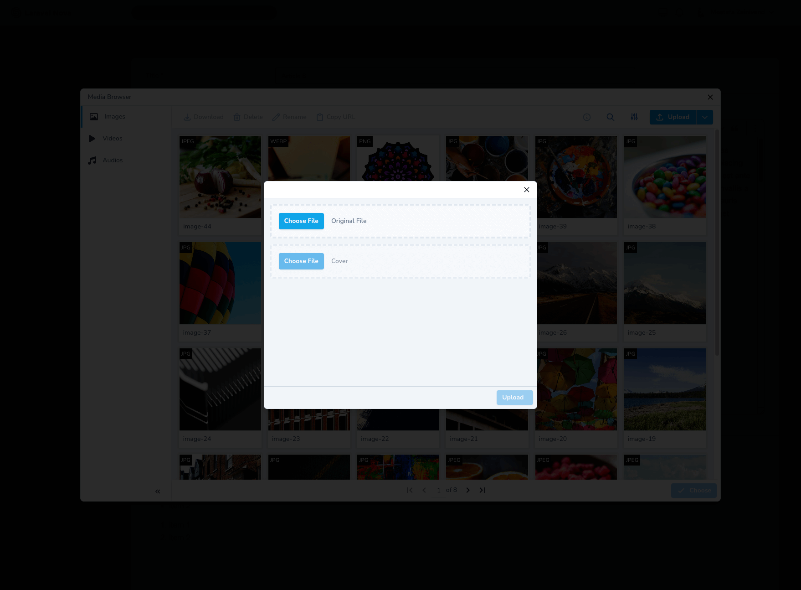<figcaption>
Upload with Cover
</figcaption></figure>

 

<figure>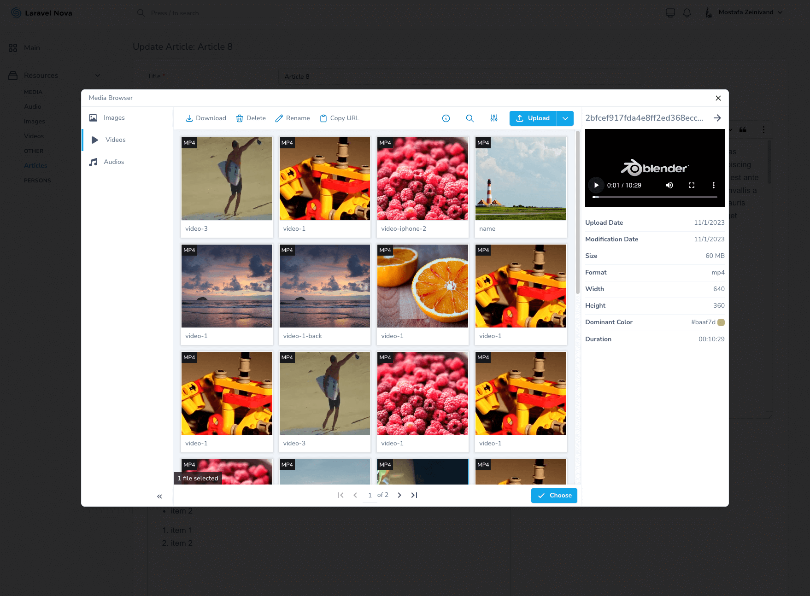<figcaption>
Play/Preview
</figcaption></figure>

 

<figure>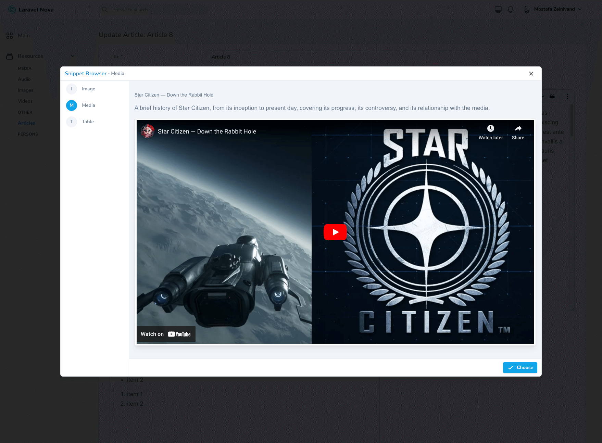<figcaption>
Snippets Brower
</figcaption></figure>

 

<figure>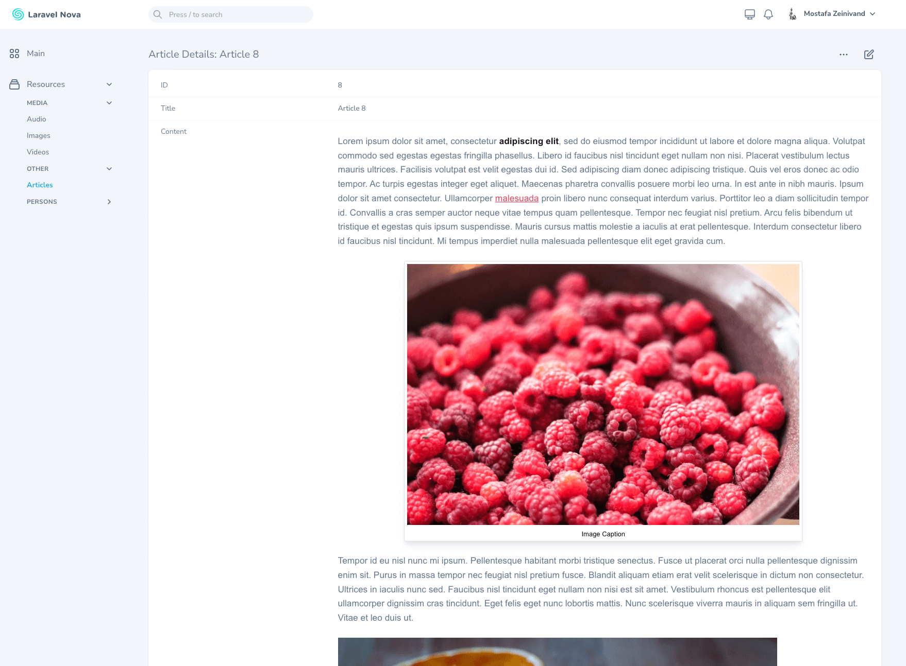<figcaption>
Details Page
</figcaption></figure>



